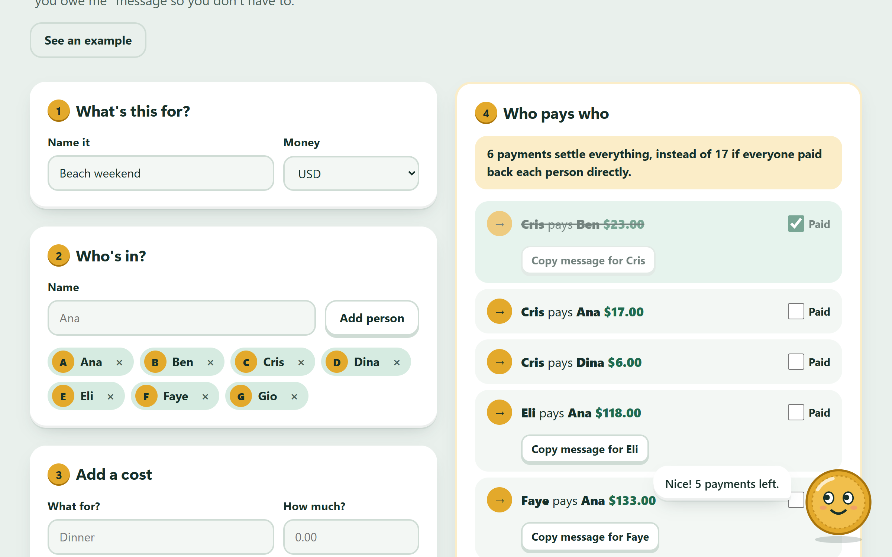

# EvenUp

Split costs with friends and settle up in as few payments as possible. Add who paid for what, and EvenUp tells you who pays who, writes the "you owe me" message for you, and lets you tick off payments as they come in. Penny the coin helps along the way.

**Try it:** https://evenup.johanthegoat.xyz



## Why

- A third of UK adults are owed money by friends or family, and 46% feel too awkward to ask for it back ([Starling Bank](https://www.starlingbank.com/news/one-third-of-uk-adults-owed-money-by-friends-and-family/)). 31% of Americans say the same ([LendingTree](https://lendingtree.com/2021/11/friend-or-family-owes-money-survey)).
- The best-known app for this limits how many costs free users can add per day and asks for a subscription past that ([KittySplit's comparison](https://www.kittysplit.com/en/splitwise-alternative), [user reviews](https://au.trustpilot.com/review/splitwise.com)).
- So EvenUp has no account, no limits, and it writes the awkward message for you.

## What you can do

- Add people, then costs. Split each cost **equally** (tick who shared it), **by shares** (a couple is 2, a kid is 0.5) or by **exact amounts** (it tells you how much is left to assign).
- See **who pays who**, in the fewest payments, and how many payments that saves.
- **Copy a message** for each person, or a summary for the group chat.
- **Tick payments** as they come in. Penny throws coins when everyone is even.
- **Share a link** so the whole group sees the same split. No server holds it.
- Change or remove any cost (with undo). Keeps working without internet once the page is open, on phones, in dark mode, with a keyboard and with a screen reader.

## Meet Penny

Penny is a coin who lives in the corner. Her eyes follow your mouse, or whatever you tap on a phone. Tap her for a tip that fits the step you're on. She reacts when you add someone, add a cost, make a mistake, copy a message or mark something paid, and she falls asleep when there's nothing to do. Tap her five times fast and she flips. You can tuck her away with the ×, and she remembers. Everything she says goes through a live region, so screen readers hear it too, and she holds still if your device asks for reduced motion.

## How it works

**Money is whole cents.** Amounts are read as integers (`"1,234.50"` and `"1.234,50"` both become 123450), so nothing drifts from floating point maths.

**Every split adds up.** Splits use the largest remainder method: each person gets the rounded-down share, then the leftover cents go to the largest fractions. $100 three ways is 33.34 / 33.33 / 33.33. Ties rotate with each cost, so the same person doesn't always pay the extra cent.

**Fewest payments, found exactly.** Settling a group in the fewest transfers is NP-hard ([Verhoeff, *Settling Multiple Debts Efficiently*, Informatics in Education 2004](https://infedu.vu.lt/journal/INFEDU/article/612)). But the answer is always `n - g`, where `n` is the number of people who are not already even and `g` is the most groups they can be split into that each add up to zero by themselves. Each such group of `k` people settles in `k - 1` payments. For up to 16 people EvenUp finds `g` with a dynamic program over subsets:

```
best[mask] = max over i in mask of best[mask without i], plus 1 if mask sums to 0
```

then walks back through the table to recover the groups, and settles each one with biggest-debtor-pays-biggest-creditor. That is 2^16 x 16 steps at most, a few milliseconds. The usual biggest-pays-biggest method on its own is not always optimal: on balances of +5, +7, +4, +4, -5, -7, -8 it takes 6 payments, while the exact search finds 4 (it's a test). Past 16 people it falls back to one greedy pass, and the page says so.

**Share links carry the data.** The split is packed as JSON, base64url, into the part of the link after `#`, which browsers never send to a server. A link can come from anyone, so everything read back is checked: people and cost limits, amounts must be whole non-negative cents, every person index must exist, exact splits must add up, names are trimmed and control characters dropped.

**Nothing leaves the page.** The Content Security Policy sets `connect-src 'none'` and `form-action 'none'`, so the page cannot send your data anywhere even by mistake. Your split is saved in this browser only.

## Run it

Open `index.html` in a browser. No build step, no dependencies.

```bash
npm test
```

The tests cover parsing, rounding (every split from 0 to 20.00 across 1 to 9 people adds back up), balances, a brute-force check of the fewest-payments answer on 400 random groups, the 16-person timing, share link round trips and every way a bad link can fail.

## Files

- `src/engine.js`: all the maths, no DOM (runs in Node for tests).
- `src/app.js`: the page.
- `src/penny.js`: Penny.
- `style.css`: claymorphism look, light and dark.

MIT licence.
